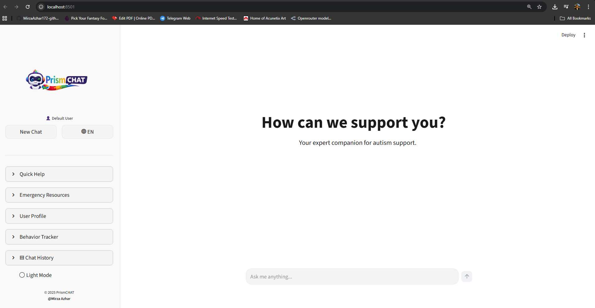
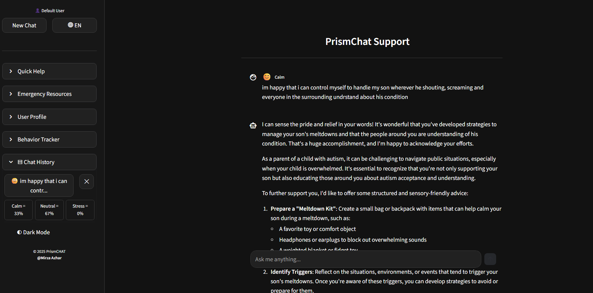
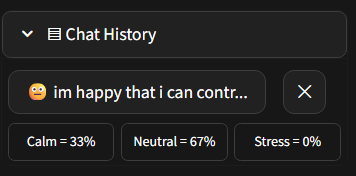

# 🌐  PrismCHAT  
**AI Chatbot for Autism Support**

**Author:** Ahmad Mirza Azhar👨🏻‍💻  
**Status:** Side Project · Research-Oriented Prototype · Portfolio Work  

---

## 📌 Project Overview

**PrismCHAT** is a personal side project developed as part of my professional portfolio, with the long-term intention of proposing and evolving it into a **Master’s level research project (Research Mode)**.

This project explores the application of **Artificial Intelligence (AI), Natural Language Processing (NLP), and Sentiment Analysis** to support autism-related guidance, emotional awareness, and caregiver assistance through an interactive chatbot interface.

While currently implemented as a **web-based prototype**, the core idea and architecture are designed to be adaptable for further academic research, experimentation, and future deployment as a full-scale application.

---

## 🎯 Motivation & Research Direction

Autism support often requires:
- Emotional sensitivity  
- Context-aware responses  
- Consistent guidance for parents and caregivers  

This project aims to investigate:
- How AI-driven conversational systems can assist autism-related support
- The role of **sentiment analysis** in understanding user emotional states
- The feasibility of using chat-based interfaces as early support tools (not diagnostic tools)

This prototype serves as a **proof-of-concept** that can be expanded into:
- Controlled experiments
- Model comparison studies
- Human–AI interaction research
- Ethical AI evaluation in mental health support systems

---

## ✨ Key Features

- 💬 **AI-powered conversational chatbot**
- 🧠 **Sentiment analysis** (emotional tone detection)
- 📊 **Session insight & emotional summary**
- 🗂️ **Chat history management**
- 🧩 **Behavior tracking (manual logging)**
- 🚨 **Emergency resources (Malaysia-focused)**
- 🌙 **Custom dark / light mode toggle**
- 🌐 **Multilingual-ready structure**
- 🧪 **Research-friendly modular architecture**

---

## 🖼️ Application Preview

### 🔹 Main Interface


### 🔹 Chat Interface (Extended View)


### 🔹 Chat History Panel


---

## 🛠️ Tech Stack

- **Frontend / Framework:** Streamlit  
- **Language:** Python  
- **AI / NLP:**  
  - VADER Sentiment Analysis  
  - TextBlob  
  - NLTK  
- **Data Handling:** Pandas, NumPy  
- **Visualization:** Plotly, Altair  
- **Environment Management:** Python Virtual Environment (`venv`)

---

**Full dependency list is available in `requirements.txt`.**

---

## 🚀 Running the Project Locally

```bash
# Clone repository
git clone https://github.com/your-username/AI-CHATBOT-FOR-AUTISM-SUPPORT.git

# Enter project directory
cd AI-CHATBOT-FOR-AUTISM-SUPPORT

# Create virtual environment
python -m venv venv

# Activate virtual environment (Windows)
venv\Scripts\activate

# Install dependencies
pip install -r requirements.txt

# Run application
streamlit run autism_chatbot.py
